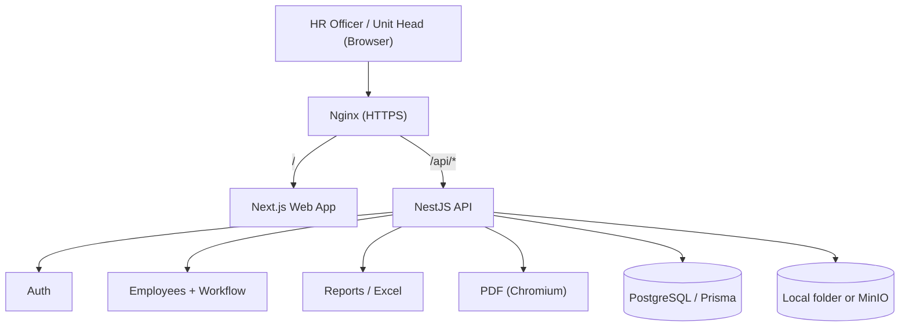
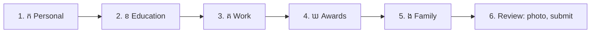
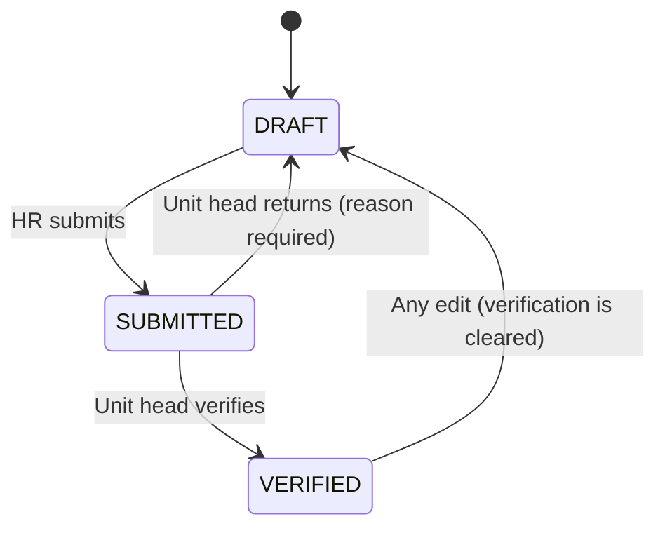
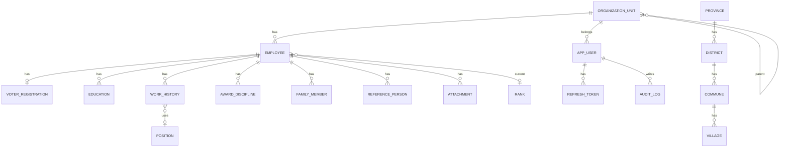

# Technical Documentation — Civil Servant Biography Management System

> **Purpose:** This document is the single source of truth for the Civil Servant Biography Management System (CSBMS). The system stores, searches, updates, and prints the official civil servant biography form (**ជីវប្រវត្តិមន្ត្រីរាជការ**) used by provincial and district administrations.
>
> **Structure:** This document follows the phase-based Technical Documentation structure (Phase 0 – Phase 14).
>
> **Important scope decision:** The frontend is **Next.js**. The backend is a separate **NestJS** REST API with **PostgreSQL** + **Prisma**. Uploaded files (photos, scanned documents) are stored in a private folder (development) or S3-compatible storage (**MinIO**, production).
>
> **Status:** Phases 0–13 are implemented in this repository. Phase 14 lists what is verified and what is still open.

---

## Phase 0 — Project Foundation

### 0.1 Technology Stack

| Area | Technology | Version | Purpose |
|---|---|---|---|
| Language | TypeScript | `5.9` | One language for frontend and backend, strict typing |
| Runtime | Node.js | `22 LTS` | Server-side runtime |
| **Frontend framework** | **Next.js (App Router)** | `15.5` | Web UI and routing; proxies `/api/*` to the API |
| UI library | React | `19.1` | Component model used by Next.js |
| Styling | Tailwind CSS | `4.1` | Utility-first styling |
| UI components | Own small components (shadcn style), `lucide-react` icons, native `<dialog>` | — | Buttons, fields, tables, dialogs; labels linked to inputs for screen readers |
| Forms | React Hook Form + Zod | `7.6` / `3.25` | Large multi-step form with validation |
| Data fetching | TanStack Query | `5` | Server-state cache, loading/error states |
| i18n | next-intl | `4` | Khmer (default) and English UI, saved in a cookie |
| Khmer font | Kantumruy Pro (`@fontsource`, self-hosted) | `5` | Same font on screen and in PDF; no Google Fonts request |
| **Backend framework** | **NestJS** | `11` | Modular REST API, DI, guards |
| Database | PostgreSQL | `16` | Persistent data (UTF-8, Khmer), `pg_trgm` for name search |
| ORM | Prisma | `6.19` | Type-safe queries and migrations |
| API docs | Swagger (`@nestjs/swagger`) | `11` | `/api/docs` (not in production) |
| Auth | JWT access token + rotating refresh token in httpOnly cookies, Argon2id | — | Login and password hashing |
| File storage | Local folder or MinIO / S3 (`@aws-sdk/client-s3`) | — | Photos 4×6, certificates, signed forms |
| PDF export | Chromium via `playwright-core` (HTML → PDF) | `1.55` | Official form with correct Khmer shaping |
| Image processing | sharp | `0.34` | Resize/crop photos to 4×6 (400×600) |
| Excel export | ExcelJS | `4.4` | Staff lists |
| Logging | nestjs-pino (JSON logs) | `4` | Request id, user id, no secrets |
| Rate limiting | `@nestjs/throttler` | `6` | Login: 10 tries/min per IP; all routes: 300/min |
| Testing | Jest + Supertest (API), Vitest + Testing Library (web, shared), Playwright (browser) | — | Unit, integration, E2E |
| Quality | ESLint 9 + Prettier 3 | — | Linting and formatting |
| Monorepo | pnpm workspaces | `10` | `apps/web`, `apps/api`, `packages/shared` |
| Process manager | PM2 | — | Production runtime for `web` and `api` |
| Reverse proxy | Nginx | — | HTTPS; `/api/*` → API, everything else → web |
| Containers | Docker Compose | Optional | Local PostgreSQL + MinIO |

**Not used (not needed yet):** Redis. Rate limiting is in memory (one API process). Add Redis only when the API runs more than one process.

### 0.2 Why this stack

- **Next.js** was chosen by the project for the frontend.
- **NestJS** keeps business rules, permissions, and audit logic in one clear backend. It matches the team's other NestJS + Prisma projects.
- **PostgreSQL** fits the form: one employee has many education rows, work rows and family members. It stores Khmer text (UTF-8) without problems.
- **Shared Zod schemas** (`packages/shared`) are used by both the Next.js form and the NestJS API, so validation rules are written once.
- **HTML → PDF with a real browser**, because many PDF libraries break Khmer subscript consonants and vowels.

> **Alternative (smaller team):** Next.js full-stack only (Route Handlers + Prisma). Fewer moving parts, but business logic and UI live in the same app.

### 0.3 Foundation Principles

- Modular, domain-oriented code (employee, education, work history, family, …).
- UI (Next.js) separate from business logic (NestJS services).
- The database and the screens follow the official form sections (ក, ខ, គ, ឃ, ង).
- Personal data (national ID, phone, family) is sensitive: role-based access, unit scope, masking, audit logs.
- Locations come from a reference table (province → district → commune → village), never free text.
- Dates are stored as real `date` values; Khmer digits (`១៥/០៦/១៩៩០`) are only for display and PDF.
- Secrets stay out of source code and logs.

### 0.4 Scope Boundary

- In scope: biography records, search, change history, verification by the unit head, PDF and Excel export.
- Out of scope (for now): payroll, attendance, leave, links to national systems, employee self-service.

---

## Phase 1 — Requirements & Scope

### 1.1 Background

Each civil servant fills a paper/Word biography form. HR staff keep many copies, and it is hard to search, update, or make reports. This system stores the form as structured data and prints the official form at any time.

### 1.2 Source form analysis

| Form part | Khmer title | Data stored |
|---|---|---|
| Header | ព្រះរាជាណាចក្រកម្ពុជា / ខេត្ត / រដ្ឋបាលស្រុក | Organization unit (printed as the unit path), photo 4×6 |
| Identity numbers | លេខសម្គាល់មន្ត្រីរាជការ, អត្តសញ្ញាណប័ណ្ណ, អត្តលេខមន្ត្រីរាជការ | Civil servant ID, national ID (9 digits), civil servant number (10 digits) |
| ក | ព័ត៌មានផ្ទាល់ខ្លួន | Name (Khmer + Latin), sex, date of birth, nationality, birth place, permanent address, voter registration, phone numbers |
| ខ | កម្រិតវប្បធម៌ទូទៅ ការបណ្តុះបណ្តាលវិជ្ជាជីវៈ និងការបណ្តុះបណ្តាលបន្ត | Rows with category (general / professional / foreign language / ongoing), course, institution, certificate, dates |
| គ | ប្រវត្តិការងារ | Joined civil service, started current position, specialty, framework/rank/grade + year; work rows by sector (Ministry of Interior / other public / private or NGO) |
| ឃ | ការសរសើរជូនរង្វាន់ ឬការដាក់វិន័យ | Rows: award or discipline, document, date, ministry, kind, form |
| ង | ព័ត៌មានគ្រួសារ | Spouse, father, mother, number of daughters and sons, 1–2 reference persons |
| Footer | ហត្ថលេខា / បានឃើញ និងបញ្ជាក់ | Declaration place and date; verification by the unit head (name and date) |

### 1.3 Functional Scope

| Capability | Status |
|---|---|
| Login with roles, lockout, change password | Implemented |
| Create / edit biography (6-step form, sections ក–ង + review) | Implemented |
| Photo 4×6 upload (auto crop) and document attachments | Implemented |
| Search & filter (name, ID numbers, unit incl. sub-units, status, gender, rank) | Implemented |
| Profile view with tabs | Implemented |
| Submit → Verify / Return workflow | Implemented |
| Official form as PDF (Khmer) and HTML preview | Implemented |
| Excel export | Implemented |
| Change history (audit trail) | Implemented |
| Dashboard (by status, gender, unit, rank, age) | Implemented |
| Settings: units, users, positions, ranks | Implemented |
| Employee self-service login | Planned |
| Import of existing Word/Excel records | Planned (decision required) |

### 1.4 Main Goals

- Replace paper forms with a searchable database.
- Keep the printed output the same as the official form.
- Make updates easy (new position, new training, new award).
- Protect personal data with role-based access, unit scope and audit logs.

### 1.5 Success Criteria

- An HR officer can enter a full biography in under 15 minutes.
- Search answers in under 1 second for 10,000 employees (trigram indexes on names).
- The printed PDF matches the official layout and renders Khmer correctly.
- Every create/update/delete/view/print/export is in the audit log.
- Users only see employees of their own unit and its sub-units (super admin sees all).

### 1.6 User Roles

| Role | Can do |
|---|---|
| `SUPER_ADMIN` | Everything in all units; manage users, units, positions, ranks |
| `HR_ADMIN` | Create/edit/delete/submit employees in own unit + sub-units; export; history |
| `UNIT_HEAD` | View employees in own unit + sub-units; verify or return; export; history |
| `VIEWER` | Read-only; national ID, civil servant number and phone numbers are masked (`012•••678`) |
| `EMPLOYEE` | Planned (self-service) |

---

## Phase 2 — Architecture

### 2.1 Architecture Overview

1. **Web Interface** — Next.js (pages, forms, tables).
2. **API / Application Layer** — NestJS (validation, authorization, workflow, audit, PDF).
3. **Persistence Layer** — PostgreSQL via Prisma.
4. **File Storage Layer** — local folder or MinIO.



In development there is no Nginx: Next.js forwards `/api/*` to the API (rewrite in `next.config.ts`). In both cases the browser talks to **one origin**, so auth cookies are first-party.

### 2.2 Architectural Rule

Business logic is not written in Next.js pages or components.

```plain text
Next.js page / component
      ↓
lib/api.ts (typed fetch, auto refresh) + TanStack Query
      ↓
NestJS controller (Zod validation pipe, role guard)
      ↓
Service (unit scope, workflow rules, audit)
      ↓
Prisma → PostgreSQL
```

### 2.3 Monorepo Layout

```plain text
employee_management/
├── apps/
│   ├── web/        # Next.js frontend
│   └── api/        # NestJS backend
├── packages/
│   └── shared/     # Zod schemas, enums, helpers, API types (web + api)
├── deploy/         # Nginx config
├── scripts/        # deploy.sh, backup.sh
└── docs/
```

---

## Phase 3 — Web Interface (Next.js)

### 3.1 Pages

| Route | Page | Roles |
|---|---|---|
| `/login` | Login (with language switch) | All |
| `/` | Dashboard | All |
| `/employees` | List: search, filters (kept in the URL), paging, Excel export | All (export: not VIEWER) |
| `/employees/new` | New biography (step 1 creates the DRAFT) | SUPER_ADMIN, HR_ADMIN |
| `/employees/[id]` | Profile: photo, status, actions, tabs (ក–ង, documents) | All |
| `/employees/[id]/edit?step=…` | Edit biography, step by step | SUPER_ADMIN, HR_ADMIN |
| `/employees/[id]/history` | Change history | not VIEWER |
| `/settings/units`, `/settings/users`, `/settings/reference` | Units tree, users, positions & ranks | SUPER_ADMIN |
| `/account` | My account, change password | All |

`middleware.ts` sends visitors without a session cookie to `/login?next=…`. This is only for the UI; the API checks every request.

### 3.2 Multi-step Biography Form



- Each step is validated in the browser with the **same Zod schema** as the API.
- Each step is saved on the server at once (`PUT /employees/:id/sections/:section`), so work is not lost.
- Repeatable rows use `useFieldArray` ("Add" / "Remove").
- Address fields are cascading selects: Province → District → Commune → Village.
- Server field errors are shown next to the field; group errors (e.g. location mismatch) in an alert.
- If someone else saved the record first (409 `STALE_VERSION`), a "Reload" button appears.

### 3.3 UI Rules

- Khmer is the default language; English can be chosen (cookie `NEXT_LOCALE`).
- Every input has a linked label; errors set `aria-invalid` and are read by screen readers.
- Friendly error messages; raw server errors are never shown.

---

## Phase 4 — Business Logic

### 4.1 Record Status Workflow



- A SUBMITTED record is **locked**: edits return 409 `RECORD_LOCKED`.
- The rules are in one pure function (`employee-workflow.ts`) with unit tests.
- Status changes use a conditional update, so two people clicking at the same time cannot both succeed.

### 4.2 Validation Rules

- National ID: 9 digits; civil servant number: 10 digits; both unique. Khmer digits are accepted and converted.
- Date of birth: age 18–70. Dates must be real (`1990-02-31` is rejected).
- End date not before start date (education, work).
- At most **one** work row without end date (= current position).
- Phone: Cambodian numbers, stored as `855…` (e.g. `012 345 678` → `85512345678`).
- At most 2 reference persons; spouse/father/mother at most once each.
- Location codes must exist and belong together (village in commune, …).
- Rank and position IDs must exist.

### 4.3 Derived Values

- Current position and unit = the work row with no end date.
- Children total = daughters + sons (the form asks for both counts).

### 4.4 Data Scope Rule

A user reads and changes only employees whose unit is the user's unit or a sub-unit (recursive query). Records outside the scope answer **404** (the API does not reveal that they exist). A user without a unit sees nothing, except `SUPER_ADMIN`.

### 4.5 Optimistic Locking

Every record has a `version`. Saving a section sends the version the user loaded. If it changed, the API answers 409 `STALE_VERSION`, and nothing is overwritten.

---

## Phase 5 — API Design (NestJS)

Base path: `/api/v1`. JSON. Dates `YYYY-MM-DD`. Swagger at `/api/docs` (not in production).

### 5.1 Auth

```plain text
POST /auth/login            { username, password } → user; sets cookies
POST /auth/refresh          rotates the refresh token
POST /auth/logout
GET  /auth/me
POST /auth/change-password  { currentPassword, newPassword } → logs out all sessions
```

### 5.2 Employees

```plain text
GET    /employees?search=&organizationUnitId=&status=&gender=&rankId=&page=&pageSize=&sort=&order=
POST   /employees                          header + section ក → DRAFT
GET    /employees/:id                      full record (masked for VIEWER)
PUT    /employees/:id/sections/:section    { version, data }  section = personal|education|work|awards|family
DELETE /employees/:id                      soft delete
POST   /employees/:id/submit
POST   /employees/:id/verify
POST   /employees/:id/return               { comment }
GET    /employees/:id/history              audit trail
GET    /employees/:id/print                HTML preview of the official form
GET    /employees/:id/pdf                  official form as PDF
```

A section save **replaces** that section's rows (the form always sends the full list).

### 5.3 Files

```plain text
POST   /employees/:id/photo                          multipart "file" (JPEG/PNG ≤ 2 MB)
GET    /employees/:id/photo
GET    /employees/:id/attachments
POST   /employees/:id/attachments                    multipart "file" + "category" (PDF/JPEG/PNG ≤ 10 MB)
GET    /employees/:id/attachments/:attachmentId/download
DELETE /employees/:id/attachments/:attachmentId
```

### 5.4 Reference data, admin, reports

```plain text
GET /locations/provinces | /provinces/:code/districts | /districts/:code/communes | /communes/:code/villages
GET/POST/PUT/DELETE /positions, /ranks          (write: SUPER_ADMIN)
GET/POST/PUT/DELETE /organization-units         (GET = units in scope; write: SUPER_ADMIN)
GET/POST/PATCH      /users                      (SUPER_ADMIN; users are deactivated, not deleted)
GET /reports/summary
GET /reports/employees.xlsx?…same filters as the list   (max 10,000 rows)
GET /health                                     public: database + storage
```

### 5.5 Error format

```json
{ "statusCode": 400, "error": "VALIDATION_ERROR", "message": "Some fields are not valid",
  "details": [{ "field": "nationalIdNo", "message": "National ID must be 9 digits" }] }
```

Error codes: `VALIDATION_ERROR`, `INVALID_FILE`, `UNAUTHENTICATED`, `TOKEN_EXPIRED`, `INVALID_CREDENTIALS`, `ACCOUNT_LOCKED` (423), `FORBIDDEN`, `BAD_ORIGIN`, `NOT_FOUND`, `DUPLICATE`, `IN_USE`, `STALE_VERSION`, `RECORD_LOCKED`, `INVALID_STATUS`, `TOO_MANY_REQUESTS`, `INTERNAL_ERROR`.

---

## Phase 6 — Database Design

The schema is in `apps/api/prisma/schema.prisma`; migrations in `apps/api/prisma/migrations/`.

### 6.1 Entity Relationship



### 6.2 Tables

| Table | Main columns |
|---|---|
| `employee` | status, version, unit, 3 ID numbers (unique), photo key, names, gender, birth date, nationality, birth place codes, house/street, address codes, phones, section គ summary (dates, specialty, rank, rank year), daughters/sons, declaration, submitted/verified info, return comment, created by, soft delete |
| `voter_registration` | 1 per employee: number, polling station, location codes, year |
| `education`, `work_history`, `award_discipline` | rows of sections ខ, គ, ឃ with `sortOrder` |
| `family_member` | spouse/father/mother (unique per employee) |
| `reference_person` | up to 2 |
| `attachment` | storage key, file name, type, size, category, uploader |
| `organization_unit` | tree (`parentId`) |
| `position`, `rank` | reference lists |
| `province`, `district`, `commune`, `village` | gazetteer codes; names stored **with** their prefix (ខេត្ត/រាជធានី, ស្រុក/ក្រុង/ខណ្ឌ, …) |
| `app_user` | username, Argon2id hash, role, unit, active, failed logins, locked until |
| `refresh_token` | SHA-256 hash only, expiry, revoked |
| `audit_log` | user, action, entity, before/after JSON, IP, time |

### 6.3 Design Notes

- Child rows are deleted with the employee row (`onDelete: Cascade`); the employee itself is soft-deleted.
- Deleting a rank, position, or unit that is still used is **blocked** (`onDelete: Restrict` → 409 `IN_USE`).
- Name search uses `pg_trgm` GIN indexes.
- A soft-deleted record keeps its unique ID numbers; creating the same person again gives `DUPLICATE`.

### 6.4 Seed data

`pnpm db:seed` adds: all 25 provinces, a **sample** of districts/communes (Kampong Speu), one rank (`ខ.១.៤ នាយកម្មការ`), common positions, an example unit tree, and the first super admin. It contains no personal data. Import the full official gazetteer with `import:locations` (see runbook 10).

### 6.5 Migration Rules

- Use Prisma migrations with clear names. Review destructive changes.
- Back up before every production migration (`scripts/deploy.sh` does this).

---

## Phase 7 — File Storage

| Driver | Use | Setting |
|---|---|---|
| `local` | development, tests, small servers | `STORAGE_LOCAL_DIR` |
| `s3` | production with MinIO / S3 | `S3_ENDPOINT`, `S3_ACCESS_KEY`, `S3_SECRET_KEY`, `S3_BUCKET` |

```plain text
employees/{employeeId}/photo.jpg
employees/{employeeId}/attachments/{attachmentId}
```

- Files are **never public**. Uploads and downloads go through the API, which checks login, role and unit scope first.
- The real file type is checked from the file's first bytes, not the name.
- Photos are rotated, cropped and resized to 400×600 JPEG.
- Khmer file names are kept (`Content-Disposition` with `filename*=UTF-8''…`).

---

## Phase 8 — Security

### 8.1 Authentication

- Argon2id password hashes. A missing username takes the same time as a wrong password.
- 5 wrong passwords → account locked for 15 minutes (423).
- Access token (JWT, 15 min) in cookie `csbms_at` (httpOnly, SameSite=Lax, Secure in production).
- Refresh token: random, stored only as SHA-256, 7 days, cookie `csbms_rt` limited to `/api/v1/auth`. It **rotates** on every use; re-use of an old token revokes all sessions of that user.
- `csbms_session` cookie is only a hint for the page guard (no secret).
- The user is re-loaded on every request, so a deactivated user is blocked at once.
- Password change or reset, and deactivation, revoke all sessions.

### 8.2 Authorization

- Global auth guard (routes are private unless marked public) + role guard + unit scope in services.

### 8.3 Other protections

- CSRF: SameSite cookies + `Origin` check on every non-GET request.
- Rate limits (login 10/min per IP).
- Helmet security headers on the API; security headers on the web app; HSTS in Nginx.
- HTML escaping in the PDF template.
- Logs contain request id, method, URL, status and user id — never cookies, tokens, passwords or bodies.
- No real personal data in the repository, tests or seed.

---

## Phase 9 — Error Handling & Reliability

- One global exception filter turns every error into the format in 5.5. Prisma errors are translated (`P2002` → `DUPLICATE` 409, `P2025` → 404, `P2003` → `IN_USE` 409). Unknown errors → 500 with a safe message; the stack goes to the log only.
- Optimistic locking (4.5) and conditional status updates (4.1) prevent lost updates.
- Each section save and its audit entry are written in **one transaction**.
- Environment variables are validated at start-up; the API stops with a clear message if one is wrong.
- The web app retries failed reads once for server errors, never for 4xx.

---

## Phase 10 — Testing

| Level | Tool | Where | Count |
|---|---|---|---|
| Unit — shared rules | Vitest | `packages/shared/src/*.test.ts` | 24 |
| Unit — API | Jest | `apps/api/src/**/*.spec.ts` (workflow, file type, env, PDF template) | 16 |
| Unit — web | Vitest + Testing Library | `apps/web/tests` (labels/accessibility, family form, error mapping) | 8 |
| Integration — API | Jest + Supertest + real PostgreSQL | `apps/api/test/app.e2e-spec.ts` | 25 |
| Browser E2E | Playwright | `apps/web/e2e` (login, full 6-step flow, submit, verify, list, history) | 3 |

The integration tests cover: login, lockout, token rotation and re-use detection, CSRF origin check, validation, duplicates, location checks, optimistic locking, unit scope, masking for VIEWER, the full workflow, audit trail, file type checks, PDF, reports scope, soft delete, admin rules.

Quality gate (also in CI): `pnpm lint && pnpm format:check && pnpm typecheck && pnpm test && pnpm --filter @csbms/api test:e2e && pnpm build`.

---

## Phase 11 — Deployment & DevOps

### 11.1 Production Architecture

```plain text
Server (Ubuntu)
├── Nginx (HTTPS)  →  /api/* → NestJS  (PM2 "csbms-api", port 4000)
│                  →  /      → Next.js (PM2 "csbms-web", port 3000)
├── PostgreSQL 16
├── Chromium (for PDF)
└── MinIO (or local folder)
```

Files: `ecosystem.config.js` (PM2), `deploy/nginx.conf`, `docker-compose.yml` (optional local PostgreSQL + MinIO).

### 11.2 Environment Variables

`apps/api/.env` (see `.env.example`): `NODE_ENV`, `PORT`, `WEB_ORIGIN`, `DATABASE_URL`, `JWT_ACCESS_SECRET` (≥ 32 chars), `JWT_ACCESS_TTL_SECONDS`, `JWT_REFRESH_TTL_DAYS`, `COOKIE_SECURE`, `STORAGE_DRIVER`, `STORAGE_LOCAL_DIR`, `S3_*`, `CHROMIUM_EXECUTABLE_PATH`, `SEED_ADMIN_USERNAME`, `SEED_ADMIN_PASSWORD`.

`apps/web/.env`: `API_INTERNAL_URL` (where Next.js forwards `/api/*`).

### 11.3 Deployment Flow

`scripts/deploy.sh`: `git pull` → `pnpm install --frozen-lockfile` → **backup** → `prisma migrate deploy` → `pnpm build` → `pm2 startOrReload` → health check (fails the deploy if not healthy).

### 11.4 CI

`.github/workflows/ci.yml`:
- **checks:** lint, format, typecheck, unit tests, API integration tests (PostgreSQL service), build.
- **browser-e2e:** builds, migrates, seeds, starts both apps, runs the Playwright tests.

### 11.5 Backup

`scripts/backup.sh`: `pg_dump` (custom format) + local files archive, keeps 30 days. Tested: a dump was restored into a new database successfully. Restore steps: runbook 9.

---

## Phase 12 — Observability & Operations

- Structured JSON logs (pino) with request id (`X-Request-Id` header), user id, status, duration.
- Audit log in the database for business actions (who, what, which record, when, IP).
- `GET /api/v1/health` checks PostgreSQL and storage (200 / 503).
- Runbooks: [docs/operations/runbooks.md](operations/runbooks.md) — site down, database down, storage down, disk full, PDF fails, locked user, stale record, stuck record, restore, gazetteer import.

---

## Phase 13 — Developer Guide

See [README.md](../README.md) for setup and commands.

### 13.1 Repository Structure

```plain text
apps/api/src/
├── main.ts, setup-app.ts, app.module.ts
├── config/                 env validation (Zod)
├── prisma/                 PrismaService
├── common/                 guards, decorators, Zod pipe, error filter, origin check
└── modules/
    ├── auth/  users/  organization-units/  locations/  reference-data/
    ├── employees/          service, controller, mapper, workflow rules
    ├── attachments/        photo + documents, file type check
    ├── storage/            local / S3 driver
    ├── pdf/                official form template + Chromium
    ├── reports/  audit/  health/
apps/api/prisma/            schema, migrations, seed, location import
apps/web/
├── app/login, app/(app)/…  pages
├── components/ui           buttons, fields, tables, dialog
├── components/employee-form  steps 1–5, wizard, location select
├── components/employee     profile, photo, actions, attachments
├── lib/                    api client, hooks, form error mapping
├── messages/km.json, en.json
└── middleware.ts
packages/shared/src/        enums, schemas, utils (Khmer digits, phone), types
```

### 13.2 Conventions

- Classes PascalCase, functions camelCase, constants UPPER_SNAKE_CASE, files kebab-case; tables snake_case (`@@map`).
- Branches `feature/…`, `fix/…`; commits `feat:`, `fix:`, `docs:`, `test:`, `chore:`.

### 13.3 Adding a field to the form

1. Add it to the Zod schema in `packages/shared` (and a test).
2. Add the column in `schema.prisma` → `pnpm db:migrate`.
3. Map it in `employees.service.ts` (write) and `employee.mapper.ts` (read); add it to `EmployeeDetail`.
4. Add the input in the step component and `to-form.ts`; add labels in `km.json` and `en.json`.
5. Show it in `profile.tsx` and, if printed, in `biography-template.ts`.

### 13.4 Code Review Checklist

- Business logic in services, not React components.
- Shared Zod schema used on both sides.
- Unit scope and role checked; audit entry written.
- No real personal data in code, tests, or seeds.
- Migration reviewed; docs updated.

---

## Phase 14 — Gap Review & Implementation Readiness

### 14.1 Architecture Decisions

| Decision | Current standard |
|---|---|
| Frontend | Next.js 15 (App Router) + Tailwind 4 + own shadcn-style components |
| Backend | Single NestJS 11 REST API |
| Database | PostgreSQL 16 + Prisma 6 |
| Files | Local folder or MinIO; always streamed through the API after permission checks |
| PDF | API HTML template → Chromium PDF (one layout for preview and PDF) |
| Auth | JWT + rotating refresh token in httpOnly cookies; Argon2id; RBAC + unit scope |
| Language | Khmer default, English optional |
| Production | PM2 + Nginx; Docker optional |

**Changes from the first design:** the print layout lives in the API (not a Next.js page), so it is the single source of the layout; uploads go through the API (not pre-signed URLs) so the server can check file content and resize photos; TanStack Table and Redis were not needed; a per-section save endpoint replaced per-row endpoints.

### 14.2 Verification Matrix

| Area | Status | Notes |
|---|---|---|
| Repository structure | ✅ Complete | Matches 13.1 |
| Database schema & migrations | ✅ Complete | 2 migrations; restore tested |
| Auth & security | ✅ Complete | Covered by integration tests |
| Employee workflow | ✅ Complete | Unit + integration + browser tests |
| PDF (Khmer) | ✅ Complete | Checked visually and in tests |
| Web UI (all pages) | ✅ Complete | Browser test for the main flow; admin pages tested by hand only |
| Location data | 🟡 Needs verification | Only provinces + a Kampong Speu sample are seeded. **Check the district/commune codes against the official NCDD gazetteer** and import the full list |
| Ranks & positions | 🟡 Needs verification | Only one rank is seeded; HR must enter the official list |
| Load test (10,000 records) | 🔴 Missing | Not run yet |
| Production server | 🔵 Decision required | Hosting, domain, TLS, MinIO or local folder |

### 14.3 Open Decisions (🔵)

| # | Question | Priority |
|---|---|---|
| 1 | How many employees and units at launch (one district or the whole province)? | P0 |
| 2 | Who verifies records — only the unit head, or also provincial HR? | P0 |
| 3 | Where is the server hosted (government data center, cloud)? | P1 |
| 4 | Do employees log in themselves (self-service)? | P1 |
| 5 | Is a digital signature needed, or print-and-sign only? | P1 |
| 6 | Import existing Word/Excel records? (needs an import tool) | P1 |

---

# Project Documentation Completion Checklist

- [x] Phase 0 — Foundation
- [x] Phase 1 — Requirements & Scope
- [x] Phase 2 — Architecture
- [x] Phase 3 — Web Interface (Next.js)
- [x] Phase 4 — Business Logic
- [x] Phase 5 — API Design
- [x] Phase 6 — Database
- [x] Phase 7 — File Storage
- [x] Phase 8 — Security
- [x] Phase 9 — Error Handling & Reliability
- [x] Phase 10 — Testing
- [x] Phase 11 — Deployment & DevOps
- [x] Phase 12 — Observability & Operations
- [x] Phase 13 — Developer Guide
- [ ] Phase 14 — Gap Review: open items in 14.2 and 14.3

> **Implementation rule:** Do not mark a section as implemented only because it is documented.
