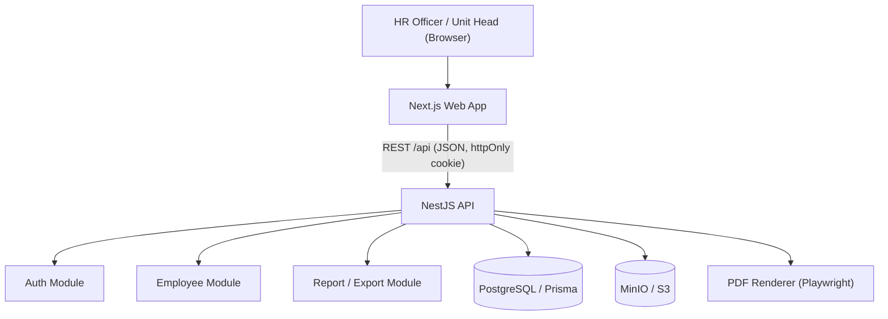
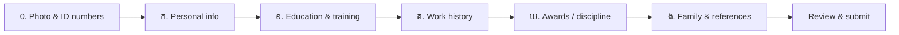
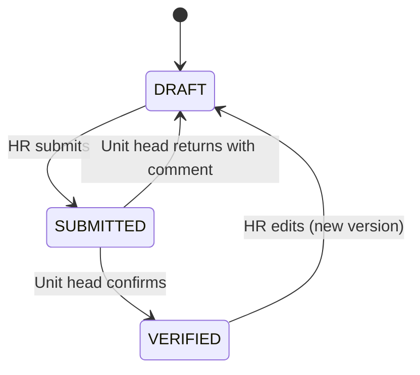
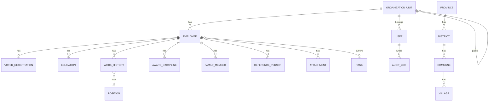

# Technical Documentation — Civil Servant Biography Management System

> **Purpose:** This document is the single source of truth for the Civil Servant Biography Management System (CSBMS). The system stores, searches, updates, and prints the official civil servant biography form (**ជីវប្រវត្តិមន្ត្រីរាជការ**) used by provincial and district administrations.
>
> **Structure:** This document follows the phase-based Technical Documentation structure (Phase 0 – Phase 14).
>
> **Important scope decision:** The frontend is **Next.js**. The backend is a separate **NestJS** REST API with **PostgreSQL** + **Prisma**. Uploaded files (photos, scanned documents) are stored in S3-compatible object storage (**MinIO**).

---

## Phase 0 — Project Foundation

### 0.1 Technology Stack

| Area | Technology | Version / Target | Purpose |
|---|---|---|---|
| Language | TypeScript | `v5.5+` | One language for frontend and backend, strict typing |
| Runtime | Node.js | `v22 LTS` | Server-side runtime |
| **Frontend framework** | **Next.js (App Router)** | `v15+` | Web UI, routing, server components, PDF preview pages |
| UI library | React | `v19` | Component model used by Next.js |
| Styling | Tailwind CSS | `v4` | Utility-first styling |
| UI components | shadcn/ui (Radix UI) | Current | Accessible forms, dialogs, tables, date pickers |
| Forms | React Hook Form + Zod | `v7` / `v3` | Large multi-section form with validation |
| Data fetching | TanStack Query | `v5` | Server-state cache, loading/error states |
| Tables | TanStack Table | `v8` | Employee list: search, filter, sort, paging |
| i18n | next-intl | `v3+` | Khmer (default) and English UI |
| Khmer font | Kantumruy Pro / Noto Sans Khmer | Google Fonts | Correct Khmer rendering on screen and in PDF |
| **Backend framework** | **NestJS** | `v11` | Modular REST API, DI, guards, validation |
| Database | PostgreSQL | `16` | Persistent data (UTF-8, full Khmer support) |
| ORM | Prisma | `v6` | Type-safe queries and migrations |
| API docs | Swagger (`@nestjs/swagger`) | Current | Auto-generated OpenAPI docs |
| Auth | JWT (access + refresh) in httpOnly cookies, Argon2id | Current | Login and password hashing |
| File storage | MinIO (S3-compatible) | Current | Photos 4×6, scanned certificates, signed forms |
| PDF export | Playwright / Puppeteer (HTML → PDF) | Current | Prints the official form with correct Khmer shaping |
| Excel export | ExcelJS | `v4` | Staff lists and reports |
| Cache (optional) | Redis | `7` | Rate limiting, refresh-token blacklist; add only when needed |
| Testing | Jest (backend), Vitest + Testing Library (frontend), Playwright (E2E) | Current | Unit, integration, E2E |
| Quality | ESLint + Prettier | Current | Linting and formatting |
| Monorepo | pnpm workspaces (+ Turborepo optional) | Current | `apps/web`, `apps/api`, `packages/shared` |
| Process manager | PM2 | Current | Production runtime for `web` and `api` |
| Reverse proxy | Nginx | Current | HTTPS, routes `/` → web, `/api` → api |
| Containers | Docker / Docker Compose | Optional | Local PostgreSQL + MinIO, CI |

### 0.2 Why this stack

- **Next.js** was chosen by the project for the frontend. The App Router gives fast pages and easy layouts.
- **NestJS** keeps business rules, permissions, and audit logic in one clear backend. It also matches the team's existing projects (same patterns as other NestJS + Prisma projects).
- **PostgreSQL** is a relational database. The biography form is highly relational: one employee has many education records, many work records, many family members. PostgreSQL also stores Khmer text (UTF-8) without problems.
- **Prisma** gives type-safe queries and easy migrations.
- **Shared Zod schemas** (`packages/shared`) are used by both the Next.js form and the NestJS API, so validation rules are written once.
- **HTML → PDF with a headless browser** is chosen because many PDF libraries do not shape Khmer text correctly (subscript consonants break). A real browser renders Khmer correctly.

> **Alternative (smaller team):** Next.js full-stack only (Route Handlers + Server Actions + Prisma, Auth.js). Fewer moving parts, but business logic and UI live in the same app. Choose this only if the team is 1–2 people and there is no need for a separate API.

### 0.3 Foundation Principles

- Keep the application modular and domain-oriented (employee, education, work history, family, …).
- Keep UI (Next.js) separate from business logic (NestJS services).
- The form structure in the database must follow the official paper form sections (ក, ខ, គ, ឃ, ង).
- Personal data (national ID, phone, family details) is sensitive. Protect it with permissions and audit logs.
- Never hard-code locations. Use a location reference table (province → district → commune → village).
- Store dates as real `date` values. Display them in Khmer numerals (`០៤/០៦/១៩៨៤`) only in the UI/PDF.
- Keep secrets out of source code and logs.

### 0.4 Scope Boundary

- In scope: civil servant biography records, search, update history, approval by head of unit, PDF/Excel export.
- Out of scope (for now): payroll, attendance, leave management, integration with national systems.

---

## Phase 1 — Requirements & Scope

### 1.1 Background

Today, each civil servant fills a paper/Word biography form. HR staff must keep many copies, and it is hard to search, update, or make reports. This system stores the form as structured data and can print the official form again at any time.

### 1.2 Source form analysis

The official form (**ជីវប្រវត្តិមន្ត្រីរាជការ**) has these parts:

| Form part | Khmer title | Data stored |
|---|---|---|
| Header | ព្រះរាជាណាចក្រកម្ពុជា / ខេត្ត / រដ្ឋបាលស្រុក | Province, district administration (organization unit), photo 4×6 |
| Identity numbers | លេខសម្គាល់មន្ត្រីរាជការ, អត្តសញ្ញាណប័ណ្ណ, អត្តលេខមន្ត្រីរាជការ | Civil servant ID, national ID card no., civil servant number |
| ក | ព័ត៌មានផ្ទាល់ខ្លួន | Name (Khmer + Latin), sex, date of birth, nationality, birth place, permanent address, voter registration, phone numbers |
| ខ | កម្រិតវប្បធម៌ទូទៅ ការបណ្តុះបណ្តាលវិជ្ជាជីវៈ និងការបណ្តុះបណ្តាលបន្ត | General education, professional training (basic / higher), foreign languages, ongoing training — each with institution, certificate, start and end date |
| គ | ប្រវត្តិការងារ | Date joined civil service, date of current position, current position, unit, specialty, framework/rank/grade; work experience at Ministry of Interior, other public sectors, private sector/NGO |
| ឃ | ការសរសើរជូនរង្វាន់ ឬការដាក់វិន័យ | Awards and disciplinary actions: document, date, ministry/institution, type, form |
| ង | ព័ត៌មានគ្រួសារ | Spouse, number of children (female/male), father, mother, 1–2 reference persons |
| Footer | ហត្ថលេខា / បានឃើញ និងបញ្ជាក់ | Declaration place & date, signature, confirmation by head of unit |

### 1.3 Functional Scope

| Capability | Status |
|---|---|
| Login with roles | Supported |
| Create / edit employee biography (multi-step form, sections ក–ង) | Supported |
| Upload photo 4×6 and supporting documents | Supported |
| Search & filter employees (name, ID, unit, position, rank) | Supported |
| View employee profile | Supported |
| Submit → Verify (head of unit confirms) workflow | Supported |
| Print official biography form as PDF (Khmer) | Supported |
| Export employee list to Excel | Supported |
| Change history (who changed what, when) | Supported |
| Dashboard (count by unit, gender, rank, age) | Supported |
| Employee self-service login | Planned |
| Payroll / leave / attendance | Not in current scope |

### 1.4 Main Goals

- Replace paper forms with a searchable database.
- Keep the printed output the same as the official form.
- Make updates easy (new position, new training, new award).
- Protect personal data with role-based access and audit logs.

### 1.5 Success Criteria

- An HR officer can enter a full biography in under 15 minutes.
- Search returns results in under 1 second for 10,000 employees.
- Printed PDF matches the official layout and renders Khmer correctly.
- Every create/update/delete is recorded in the audit log.
- Users can only see employees in their own unit (unless admin).

### 1.6 User Roles

| Role | Can do |
|---|---|
| `SUPER_ADMIN` | Everything, manage users, units, reference data |
| `HR_ADMIN` | Create/edit/delete employees in their unit and child units, export |
| `UNIT_HEAD` | View employees in their unit, verify (confirm) biographies |
| `VIEWER` | Read-only access in their unit |
| `EMPLOYEE` (planned) | View own record, request corrections |

---

## Phase 2 — Architecture

### 2.1 Architecture Overview

1. **Web Interface** — Next.js (pages, forms, tables, PDF preview).
2. **API / Application Layer** — NestJS (validation, authorization, workflow, audit).
3. **Persistence Layer** — PostgreSQL via Prisma.
4. **File Storage Layer** — MinIO (photos, attachments, generated PDFs).



### 2.2 Architectural Rule

Business logic must not be written inside Next.js pages or components.

```plain text
Next.js Page / Component
      ↓
API client (typed fetch + TanStack Query)
      ↓
NestJS Controller (DTO validation)
      ↓
Service (business rules, permission checks)
      ↓
Prisma Repository
      ↓
PostgreSQL
```

### 2.3 Monorepo Layout (high level)

```plain text
employee_management/
├── apps/
│   ├── web/        # Next.js frontend
│   └── api/        # NestJS backend
├── packages/
│   └── shared/     # Zod schemas, enums, types shared by web + api
└── docs/
```

### 2.4 Communication Flow

- Browser → Next.js (HTTPS via Nginx)
- Next.js → NestJS REST API (`/api/v1/...`)
- NestJS → PostgreSQL (Prisma)
- NestJS → MinIO (pre-signed URLs for upload/download)
- NestJS → Playwright (render `/print/employees/:id` page → PDF)

---

## Phase 3 — Web Interface (Next.js)

### 3.1 Main Pages

| Route | Page | Roles |
|---|---|---|
| `/login` | Login | All |
| `/` | Dashboard (totals, charts by unit / gender / rank) | All |
| `/employees` | Employee list (search, filters, paging, export) | All |
| `/employees/new` | New biography (multi-step form) | HR_ADMIN+ |
| `/employees/[id]` | Profile view (tabs by section) | All |
| `/employees/[id]/edit` | Edit biography | HR_ADMIN+ |
| `/employees/[id]/history` | Change history | HR_ADMIN+ |
| `/print/employees/[id]` | Print layout (A4, same as official form) | Internal / All |
| `/settings/units` | Organization units | SUPER_ADMIN |
| `/settings/users` | Users and roles | SUPER_ADMIN |
| `/settings/reference` | Positions, ranks, locations, education levels | SUPER_ADMIN |

### 3.2 Multi-step Biography Form

The form follows the paper form, one step per section:



- Each step is validated with the shared Zod schema before moving on.
- Repeatable rows (education, work history, awards, references) use `useFieldArray` from React Hook Form (“+ Add row” button).
- Draft is saved to the API on each step (status `DRAFT`), so work is not lost.
- Address fields use cascading selects: Province → District → Commune → Village.
- Date inputs accept `dd/mm/yyyy`; display can use Khmer numerals.

### 3.3 Employee Profile View

Tabs: **Personal**, **Education**, **Work**, **Awards/Discipline**, **Family**, **Documents**, **History**. Buttons: **Edit**, **Print PDF**, **Submit for verification**, **Verify** (unit head only).

### 3.4 Print Layout

`/print/employees/[id]` is a server-rendered A4 page that copies the official layout (header, photo box 4×6, sections ក–ង, signature blocks). The backend opens this page with Playwright and saves it as PDF. CSS uses `@page { size: A4; margin: 15mm; }` and a Khmer font (Khmer OS Siemreap / Kantumruy Pro).

### 3.5 UI Rules

- Khmer is the default language; English is optional (next-intl).
- Do not show national ID or phone in list pages to `VIEWER` role (mask as `0305•••853`).
- Show friendly error messages, never raw server errors.

---

## Phase 4 — Business Logic

### 4.1 Record Status Workflow



- A `VERIFIED` record stores who verified it and when (the “បានឃើញ និងបញ្ជាក់” block).
- Editing a verified record creates a new version and returns it to `DRAFT`.

### 4.2 Validation Rules (examples)

- National ID: 9 digits, unique.
- Civil servant number (អត្តលេខមន្ត្រីរាជការ): 10 digits, unique.
- Date of birth: age between 18 and 70.
- `end_date` must be after `start_date` (education, work history).
- Only **one** open work-history row (no end date) = current position.
- Phone: Cambodian format (`0xx xxx xxx` or `855…`), normalize to `855…`.
- At most 2 reference persons.

### 4.3 Derived Values

- Current position / unit = work-history row with no `end_date`.
- Years of service = today − `civil_service_start_date`.
- Children count (female/male/total) — stored as numbers because the form only asks for counts.

### 4.4 Data Scope Rule

A user can only read or change employees whose `organization_unit` is the user's unit or a child unit. `SUPER_ADMIN` sees all.

---

## Phase 5 — API Design (NestJS)

Base path: `/api/v1`. All responses use JSON. Dates use ISO format `YYYY-MM-DD`.

### 5.1 Auth

```plain text
POST /auth/login          { username, password } → sets httpOnly cookies
POST /auth/refresh        → new access token
POST /auth/logout
GET  /auth/me             → current user + role + unit
```

### 5.2 Employees

```plain text
GET    /employees?search=&unitId=&positionId=&rankId=&gender=&status=&page=&size=
POST   /employees                         create (DRAFT)
GET    /employees/:id                     full biography (all sections)
PATCH  /employees/:id                     update section ក + identity
DELETE /employees/:id                     soft delete
POST   /employees/:id/submit
POST   /employees/:id/verify
POST   /employees/:id/return              { comment }
GET    /employees/:id/history             audit trail
GET    /employees/:id/pdf                 official form PDF
```

### 5.3 Child collections (same pattern for each)

```plain text
GET/POST          /employees/:id/educations
PATCH/DELETE      /employees/:id/educations/:educationId
... /work-histories, /awards, /family-members, /references, /attachments
```

### 5.4 Files

```plain text
POST /employees/:id/photo/upload-url      → pre-signed PUT URL (MinIO)
POST /employees/:id/attachments/upload-url
GET  /attachments/:id/download-url
```

### 5.5 Reference data & reports

```plain text
GET /locations/provinces
GET /locations/provinces/:code/districts
GET /locations/districts/:code/communes
GET /locations/communes/:code/villages
GET /positions, /ranks, /education-levels, /organization-units
GET /reports/summary                        dashboard numbers
GET /reports/employees.xlsx?...filters      Excel export
```

### 5.6 Example: GET /employees/:id (short)

```json
{
  "id": "b3c1…",
  "status": "VERIFIED",
  "civilServantId": "7139",
  "nationalIdNo": "030506853",
  "civilServantNo": "1840500219",
  "nameKh": "សុខ សុភា",
  "nameLatin": "SOK SOPHEA",
  "gender": "FEMALE",
  "dateOfBirth": "1990-01-15",
  "birthPlace": { "villageCode": "…", "communeCode": "…", "districtCode": "…", "provinceCode": "05" },
  "currentPosition": { "title": "…", "unit": "…", "since": "2023-02-06" },
  "educations": [],
  "workHistories": [],
  "awards": [],
  "familyMembers": [],
  "references": []
}
```

> The example uses fake data. Real personal data must never be put in docs, tests, or seed files.

### 5.7 Error format

```json
{ "statusCode": 400, "error": "VALIDATION_ERROR", "message": "…", "details": [{ "field": "nationalIdNo", "message": "Must be 9 digits" }] }
```

---

## Phase 6 — Database Design

### 6.1 Entity Relationship



### 6.2 Prisma Schema (draft)

```prisma
enum Gender       { MALE FEMALE }
enum RecordStatus { DRAFT SUBMITTED VERIFIED }
enum Role         { SUPER_ADMIN HR_ADMIN UNIT_HEAD VIEWER EMPLOYEE }
enum EducationCategory { GENERAL PROFESSIONAL FOREIGN_LANGUAGE ONGOING_TRAINING }
enum WorkSector   { MINISTRY_OF_INTERIOR OTHER_PUBLIC PRIVATE_OR_NGO }
enum AwardType    { AWARD DISCIPLINE }
enum FamilyRelation { SPOUSE FATHER MOTHER }

// ---------- Reference / location ----------
model Province { code String @id  nameKh String  nameEn String  districts District[] }
model District { code String @id  nameKh String  nameEn String  provinceCode String  province Province @relation(fields: [provinceCode], references: [code])  communes Commune[] }
model Commune  { code String @id  nameKh String  nameEn String  districtCode String  district District @relation(fields: [districtCode], references: [code])  villages Village[] }
model Village  { code String @id  nameKh String  nameEn String  communeCode String  commune Commune @relation(fields: [communeCode], references: [code]) }

model OrganizationUnit {
  id        String  @id @default(uuid())
  nameKh    String
  nameEn    String?
  parentId  String?
  parent    OrganizationUnit?  @relation("UnitTree", fields: [parentId], references: [id])
  children  OrganizationUnit[] @relation("UnitTree")
  employees Employee[]
  users     User[]
}

model Position { id String @id @default(uuid())  nameKh String  nameEn String? }

// Civil service framework, e.g. ខ.១.៤ / នាយកម្មការ / ថ្នាក់លេខ ៤
model Rank {
  id        String @id @default(uuid())
  framework String   // "ខ.១.៤"
  titleKh   String   // "នាយកម្មការ"
  grade     Int      // 4
}

// ---------- Employee (form header + section ក + summary of គ) ----------
model Employee {
  id                  String   @id @default(uuid())
  status              RecordStatus @default(DRAFT)
  organizationUnitId  String
  organizationUnit    OrganizationUnit @relation(fields: [organizationUnitId], references: [id])

  civilServantId      String?  @unique   // លេខសម្គាល់មន្ត្រីរាជការ
  nationalIdNo        String?  @unique   // អត្តសញ្ញាណប័ណ្ណ
  civilServantNo      String?  @unique   // អត្តលេខមន្ត្រីរាជការ
  photoKey            String?            // MinIO object key

  nameKh              String
  nameLatin           String
  gender              Gender
  dateOfBirth         DateTime @db.Date
  nationality         String   @default("ខ្មែរ")
  birthVillageCode    String?
  birthCommuneCode    String?
  birthDistrictCode   String?
  birthProvinceCode   String?

  houseNo             String?
  streetNo            String?
  addrVillageCode     String?
  addrCommuneCode     String?
  addrDistrictCode    String?
  addrProvinceCode    String?
  phone1              String?
  phone2              String?

  // Section គ summary
  civilServiceStartDate    DateTime? @db.Date   // ថ្ងៃចូលបម្រើការងារក្នុងក្របខ័ណ្ឌរដ្ឋ
  currentPositionStartDate DateTime? @db.Date   // ថ្ងៃចូលកាន់មុខតំណែងបច្ចុប្បន្ន
  currentPositionId        String?
  specialty                String?              // ជំនាញវិជ្ជាជីវៈ
  rankId                   String?
  rank                     Rank?     @relation(fields: [rankId], references: [id])
  rankYear                 Int?

  // Section ង children counts
  childrenTotal       Int @default(0)
  childrenFemale      Int @default(0)
  childrenMale        Int @default(0)

  // Footer
  declaredPlace       String?
  declaredDate        DateTime? @db.Date
  verifiedById        String?
  verifiedAt          DateTime?

  voterRegistration   VoterRegistration?
  educations          Education[]
  workHistories       WorkHistory[]
  awards              AwardDiscipline[]
  familyMembers       FamilyMember[]
  references          ReferencePerson[]
  attachments         Attachment[]

  createdAt DateTime @default(now())
  updatedAt DateTime @updatedAt
  deletedAt DateTime?

  @@index([nameKh])
  @@index([nameLatin])
  @@index([organizationUnitId])
}

model VoterRegistration {
  id            String @id @default(uuid())
  employeeId    String @unique
  employee      Employee @relation(fields: [employeeId], references: [id], onDelete: Cascade)
  voterNo       String?     // លេខរៀង
  pollingStation String?    // ការិយាល័យបោះឆ្នោត
  villageCode   String?
  communeCode   String?
  districtCode  String?
  provinceCode  String?
  year          Int?
}

// ---------- Section ខ ----------
model Education {
  id          String @id @default(uuid())
  employeeId  String
  employee    Employee @relation(fields: [employeeId], references: [id], onDelete: Cascade)
  category    EducationCategory
  levelOrCourse String      // កម្រិតសិក្សា / វគ្គ
  institution String?       // គ្រឹះស្ថានសិក្សា
  certificate String?       // សញ្ញាបត្រ
  startDate   DateTime? @db.Date
  endDate     DateTime? @db.Date
  sortOrder   Int @default(0)
}

// ---------- Section គ ----------
model WorkHistory {
  id          String @id @default(uuid())
  employeeId  String
  employee    Employee @relation(fields: [employeeId], references: [id], onDelete: Cascade)
  sector      WorkSector
  startDate   DateTime  @db.Date
  endDate     DateTime? @db.Date     // null = current
  positionId  String?
  position    Position? @relation(fields: [positionId], references: [id])
  positionText String?               // free text if not in list
  ministryOrInstitution String?      // ក្រសួង ស្ថាប័ន
  unit        String?                // អង្គភាព
}

// ---------- Section ឃ ----------
model AwardDiscipline {
  id          String @id @default(uuid())
  employeeId  String
  employee    Employee @relation(fields: [employeeId], references: [id], onDelete: Cascade)
  type        AwardType
  documentRef String?     // ឯកសារបញ្ជាក់
  date        DateTime? @db.Date
  ministryOrInstitution String?
  kind        String?     // ប្រភេទ
  form        String?     // ទម្រង់
}

// ---------- Section ង ----------
model FamilyMember {
  id          String @id @default(uuid())
  employeeId  String
  employee    Employee @relation(fields: [employeeId], references: [id], onDelete: Cascade)
  relation    FamilyRelation
  name        String
  isAlive     Boolean @default(true)
  dateOfBirth DateTime? @db.Date
  occupation  String?
  address     String?
  birthPlace  String?
  phone1      String?
  phone2      String?
  @@unique([employeeId, relation])
}

model ReferencePerson {
  id          String @id @default(uuid())
  employeeId  String
  employee    Employee @relation(fields: [employeeId], references: [id], onDelete: Cascade)
  name        String
  gender      Gender?
  occupation  String?
  phone       String?
  address     String?
  sortOrder   Int @default(1)   // 1 or 2
}

// ---------- Files, users, audit ----------
model Attachment {
  id          String @id @default(uuid())
  employeeId  String
  employee    Employee @relation(fields: [employeeId], references: [id], onDelete: Cascade)
  objectKey   String
  fileName    String
  mimeType    String
  sizeBytes   Int
  category    String     // CERTIFICATE, SIGNED_FORM, OTHER
  uploadedById String
  createdAt   DateTime @default(now())
}

model User {
  id                 String @id @default(uuid())
  username           String @unique
  passwordHash       String            // Argon2id
  fullName           String
  role               Role
  organizationUnitId String?
  organizationUnit   OrganizationUnit? @relation(fields: [organizationUnitId], references: [id])
  isActive           Boolean @default(true)
  lastLoginAt        DateTime?
  auditLogs          AuditLog[]
  createdAt          DateTime @default(now())
}

model AuditLog {
  id         BigInt   @id @default(autoincrement())
  userId     String?
  user       User?    @relation(fields: [userId], references: [id])
  action     String   // CREATE, UPDATE, DELETE, SUBMIT, VERIFY, EXPORT, PRINT, LOGIN
  entity     String   // Employee, Education, ...
  entityId   String
  before     Json?
  after      Json?
  ip         String?
  createdAt  DateTime @default(now())
  @@index([entity, entityId])
}
```

### 6.3 Design Notes

- Child tables use `onDelete: Cascade`; the `Employee` itself uses soft delete (`deletedAt`).
- Location codes follow the official Cambodian gazetteer codes (province `05` = Kampong Speu). Seed them once from the national gazetteer list.
- Search: add PostgreSQL `pg_trgm` index on `nameKh` and `nameLatin` for fast partial search.

### 6.4 Migration Rules

- Use Prisma migrations with meaningful names (`add_voter_registration`).
- Review destructive changes. Test on staging before production.
- Back up the database before every production migration.

---

## Phase 7 — File Storage (MinIO)

### 7.1 Buckets and keys

```plain text
bucket: csbms
employees/{employeeId}/photo.jpg
employees/{employeeId}/attachments/{attachmentId}-{fileName}
employees/{employeeId}/pdf/{version}.pdf
```

### 7.2 Rules

- Upload and download use **pre-signed URLs** (short expiry, 5 minutes). Files are never public.
- Photo: JPEG/PNG, max 2 MB, resized to 4×6 ratio (Sharp).
- Attachments: PDF/JPEG/PNG, max 10 MB.
- Check MIME type on the server, not only the file extension.

---

## Phase 8 — Security

### 8.1 Authentication

- Username + password, hashed with **Argon2id**.
- Access token (15 min) and refresh token (7 days) in **httpOnly, Secure, SameSite=Lax** cookies.
- Lock account for 15 minutes after 5 failed logins.

### 8.2 Authorization

- Role guard (`@Roles()`) + unit-scope guard on every employee endpoint.
- Next.js `middleware.ts` redirects to `/login` when there is no session (UI only — the API always re-checks).

### 8.3 Personal Data Protection

- HTTPS everywhere (Nginx + Let's Encrypt).
- Encrypt disks / database backups.
- Mask national ID and phone for `VIEWER`.
- Log every **view of full profile**, **print**, and **export** in `AuditLog`.
- Never put real employee data in Git, test fixtures, or logs.

### 8.4 Other

- CSRF protection for cookie auth (double-submit token or SameSite + origin check).
- Rate limit login endpoint (`@nestjs/throttler`).
- Security headers (Helmet on API, `next.config` headers on web).

---

## Phase 9 — Error Handling & Reliability

### 9.1 Error Categories

```plain text
ValidationError     → 400
AuthenticationError → 401
AuthorizationError  → 403
NotFoundError       → 404
ConflictError       → 409 (duplicate national ID, stale version)
StorageError        → 502
InternalError       → 500
```

### 9.2 User-Facing Errors

Bad: `PrismaClientKnownRequestError P2002`
Good: `លេខអត្តសញ្ញាណប័ណ្ណនេះមានរួចហើយ (This national ID already exists).`

### 9.3 Concurrent edits

Use optimistic locking: the client sends `updatedAt`; if it does not match, return `409 Conflict` and ask the user to reload.

---

## Phase 10 — Testing

| Level | Tool | Examples |
|---|---|---|
| Unit | Jest / Vitest | Zod schemas, phone normalization, date rules, status workflow |
| Integration | Jest + test PostgreSQL | Employee CRUD, unit-scope permission, audit log written |
| E2E | Playwright | Login → create biography → submit → verify → print PDF |
| Visual | Playwright screenshot | PDF print page matches expected layout |

Quality gate before merge:

```plain text
pnpm lint
pnpm test
pnpm build
```

---

## Phase 11 — Deployment & DevOps

### 11.1 Production Architecture

```plain text
Server (Ubuntu)
├── Nginx (HTTPS)  →  /      → Next.js (PM2, port 3000)
│                  →  /api   → NestJS  (PM2, port 4000)
├── PostgreSQL 16
└── MinIO
```

Docker Compose is optional for local development (PostgreSQL + MinIO).

### 11.2 Environment Variables

```plain text
# apps/api
DATABASE_URL=
JWT_ACCESS_SECRET=
JWT_REFRESH_SECRET=
S3_ENDPOINT=
S3_ACCESS_KEY=
S3_SECRET_KEY=
S3_BUCKET=csbms
WEB_BASE_URL=            # used by PDF renderer

# apps/web
NEXT_PUBLIC_API_BASE_URL=
```

### 11.3 Deployment Flow

```plain text
git pull
pnpm install --frozen-lockfile
pnpm --filter api prisma migrate deploy
pnpm build
pm2 reload ecosystem.config.js
health check (/api/health)
smoke test (login + open one profile)
```

### 11.4 Backup

- Daily `pg_dump` (keep 30 days) + weekly off-site copy.
- MinIO bucket replication or daily sync.
- Test restore once per month.

---

## Phase 12 — Observability & Operations

- Structured JSON logs (`pino`) with `requestId`, `userId`, `action`, `durationMs`.
- Health endpoint: `/api/health` checks PostgreSQL and MinIO.
- Monitor: uptime, error rate, slow queries, disk space, backup success.
- Runbooks: API down, database down, disk full, restore from backup.

---

## Phase 13 — Developer Guide

### 13.1 Repository Structure

```plain text
employee_management/
├── apps/
│   ├── web/                          # Next.js
│   │   ├── app/
│   │   │   ├── [locale]/(auth)/login/
│   │   │   ├── [locale]/(dashboard)/employees/
│   │   │   ├── [locale]/(dashboard)/settings/
│   │   │   └── print/employees/[id]/
│   │   ├── components/
│   │   │   ├── ui/                   # shadcn/ui
│   │   │   └── employee-form/        # one component per section ក–ង
│   │   ├── lib/api/                  # typed API client
│   │   ├── messages/km.json, en.json
│   │   └── middleware.ts
│   └── api/                          # NestJS
│       ├── src/modules/
│       │   ├── auth/  users/  organization-units/
│       │   ├── employees/  educations/  work-histories/
│       │   ├── awards/  family/  attachments/
│       │   ├── locations/  reference-data/
│       │   ├── reports/  pdf/  audit/  health/
│       └── prisma/schema.prisma, migrations/, seed.ts
├── packages/shared/                  # Zod schemas + enums
├── docs/
├── ecosystem.config.js
├── docker-compose.yml
└── pnpm-workspace.yaml
```

### 13.2 Naming

- Classes: PascalCase — Variables/functions: camelCase — Constants: UPPER_SNAKE_CASE — Files: kebab-case.
- Database tables: snake_case via Prisma `@@map`.

### 13.3 Git

Branches: `feature/…`, `fix/…`, `refactor/…`, `chore/…`.
Commits: `feat: add education section form`, `fix: khmer font in pdf`, `docs: update api design`.

### 13.4 Code Review Checklist

- Business logic is in NestJS services, not in React components.
- Shared Zod schema is used on both sides.
- Unit-scope permission is checked.
- Audit log is written.
- No real personal data in code, tests, or seeds.
- Migration reviewed. Docs updated.

---

## Phase 14 — Gap Review & Implementation Readiness

### 14.1 Architecture Decisions

| Decision | Current standard |
|---|---|
| Frontend | Next.js (App Router) + Tailwind + shadcn/ui |
| Backend | Single NestJS REST API |
| Database | PostgreSQL 16 + Prisma |
| Files | MinIO (S3-compatible), private, pre-signed URLs |
| PDF | HTML print page → Playwright PDF (Khmer-safe) |
| Auth | JWT in httpOnly cookies, Argon2id passwords, RBAC + unit scope |
| Language | Khmer default, English optional |
| Production | PM2 + Nginx; Docker optional |

### 14.2 Open Decisions (🔵 Decision Required)

| # | Question | Priority |
|---|---|---|
| 1 | How many employees and units at launch (one district or whole province)? | P0 |
| 2 | Who verifies records — only unit head, or also provincial HR? | P0 |
| 3 | Do employees log in themselves (self-service)? | P1 |
| 4 | Where is the server hosted (government data center, cloud)? | P1 |
| 5 | Is a digital signature needed, or print-and-sign only? | P1 |
| 6 | Import existing Word/Excel records? (needs import tool) | P1 |

### 14.3 Implementation Plan (suggested order)

1. Monorepo setup, shared package, lint/format, Docker Compose (PostgreSQL + MinIO).
2. Prisma schema + migrations + seed (locations, ranks, positions, admin user).
3. Auth + users + organization units + RBAC.
4. Employee CRUD API + section endpoints + audit.
5. Next.js layout, login, employee list.
6. Multi-step biography form (sections ក–ង).
7. Photo/attachment upload.
8. Submit/verify workflow.
9. Print page + PDF export.
10. Dashboard + Excel export.
11. Tests, deployment, backup, go-live.

---

# Project Documentation Completion Checklist

- [ ] Phase 0 — Foundation
- [ ] Phase 1 — Requirements & Scope
- [ ] Phase 2 — Architecture
- [ ] Phase 3 — Web Interface (Next.js)
- [ ] Phase 4 — Business Logic
- [ ] Phase 5 — API Design
- [ ] Phase 6 — Database
- [ ] Phase 7 — File Storage
- [ ] Phase 8 — Security
- [ ] Phase 9 — Error Handling & Reliability
- [ ] Phase 10 — Testing
- [ ] Phase 11 — Deployment & DevOps
- [ ] Phase 12 — Observability & Operations
- [ ] Phase 13 — Developer Guide
- [ ] Phase 14 — Gap Review & Implementation Readiness

> **Implementation rule:** Do not mark a section as implemented only because it is documented.
